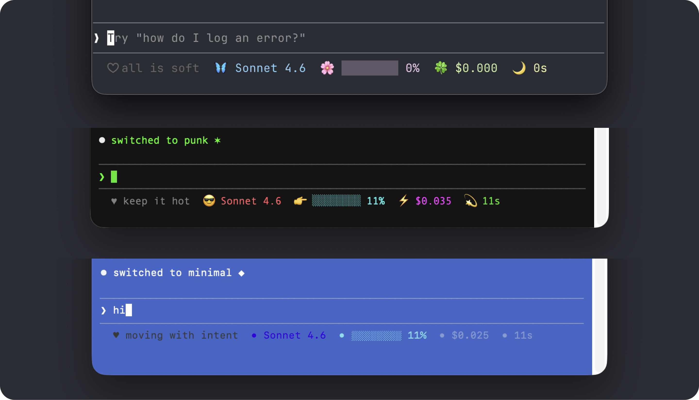

# claude-mood

statusline theme system for claude code in terminal. three starter themes and a `/mood` command to switch between them. all theme files live at `~/.claude/mood/`. ask Claude to edit them or create new ones — change colors, icons, titles, or anything else.

**cute** — soft pastels. rotating titles: *the path is kind · growing gently · all is soft*

**punk** — neon and bright. rotating titles: *keep it hot · so wired · let's rip*

**minimal** — clean and quiet. rotating titles: *clear and quiet · steady as i go · moving with intent*



## install

**1. make sure you have jq installed** (required for the statusline to read session data)
```bash
brew install jq
```

**2. run the installer**
```bash
curl -fsSL https://raw.githubusercontent.com/mandy-thao/claude-mood/main/install.sh | bash
```

**3. restart Claude Code** — the statusline will appear at the bottom of your window.

that's it! you'll start on the `cute` theme. switch anytime with `/mood`.

## usage

```
/mood minimal
/mood cute
/mood punk
```

to preview all available colors in your terminal:
```bash
bash ~/.claude/mood/show-colors.sh
```

## what's in the statusline

| element | description |
|---|---|
| `♥︎ title` | rotating session title |
| model | current Claude model |
| bar | context window usage |
| cost | session cost in USD |
| duration | session duration |
| `→ branch` | git branch (when in a repo) |
